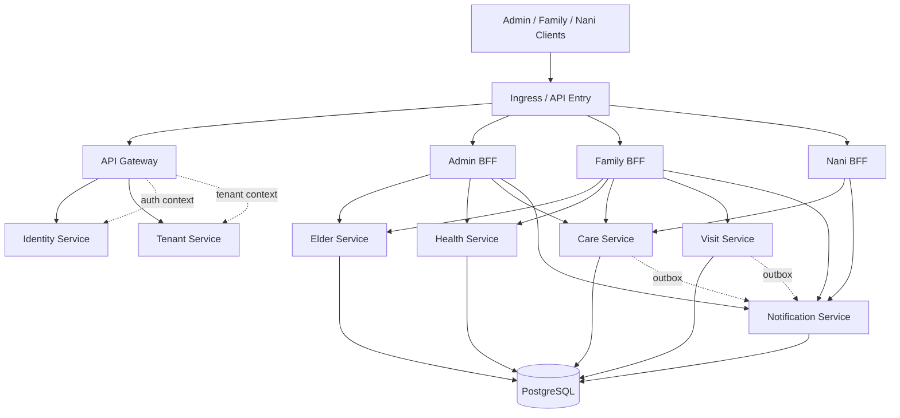

# Backend 云原生 Kubernetes 架构

## Scope

- 适用仓库: nursing-backend-services
- 适用对象: backend 平台团队、DevOps 团队、SRE 团队
- 变更目标: 将当前基于本地 compose 的多服务后端演进为可在 Kubernetes 集群中部署、扩缩、发布和观测的云原生架构
- 发布阶段: 第一阶段 k8s 基线部署资产已完成，第二阶段 migration、broker 异步消费、GitOps 发布顺序和 prod 外部依赖接入入口已完成，当前进入生产可运维性收尾阶段
- 回滚方式: 回退 k8s 清单与相关配置，保留本地 compose 与当前 .NET 运行模型

## Architecture Positioning

当前 backend 已具备以下基础:

- API Gateway + 3 个 BFF + 多领域服务 的分层结构
- 基于 JWT bearer 的统一认证入口
- 基于 PostgreSQL 的核心持久化基线
- 基于 outbox 的事件回流雏形

Kubernetes 方案的目标不是简单把进程“搬上去”，而是把运行面调整为以下模型:

- 控制面: Git 驱动的 YAML 或 Kustomize 资产
- 计算面: Gateway、BFF、领域服务运行在 Deployment 中
- 数据面: PostgreSQL、Redis、RabbitMQ、Keycloak、Seq 优先使用云托管服务，开发环境可保留集群内或 compose 形态
- 流量面: Ingress 暴露公网入口，ClusterIP 作为服务间调用平面
- 观测面: 健康检查、结构化日志、指标、trace 统一汇聚

## Deployment Topology



## Workload Design

### 1. Edge Layer

- API Gateway: 单独 Deployment，对外暴露 `/api/gateway/*` 与平台入口能力
- Admin BFF / Family BFF / Nani BFF: 各自独立 Deployment，通过 Ingress 路径暴露
- 建议副本数:
  - Gateway: 2 起步
  - Admin BFF: 2 起步
  - Family BFF: 2 起步
  - Nani BFF: 2 起步

### 2. Domain Layer

- Identity、Tenant、Elder、Care、Health、Visit、Notification 为核心服务，进入第一批 k8s 交付
- Staffing、Operations、Billing、AiOrchestration 属于扩展域，也进入 Deployment 基线，但默认以低副本运行
- 所有领域服务只暴露 ClusterIP，不直接面向公网

### 3. Data Plane

生产环境建议:

- PostgreSQL: 云托管 PostgreSQL
- Redis: 云托管 Redis
- RabbitMQ: 托管消息服务或 Operator 管理
- Keycloak: 独立高可用集群或托管身份平台
- Seq: 可替换为 Loki / ELK / 云日志平台

开发与集成环境可接受:

- compose 运行基础设施
- 或在 k8s dev overlay 中使用临时依赖

本地 compose 入口约定:

- backend 根目录提供 `docker-compose-infras.yml` 作为开发入口，统一拉起 PostgreSQL、Redis、RabbitMQ、Keycloak、Seq。
- 该入口继续复用 `deploy/postgres/init/01-create-service-databases.sh`，确保本地仍按服务独立数据库启动，而不是回退到共享数据库。
- 本地服务默认端口需与当前 launchSettings 基线保持一致: gateway `5200`、family-bff `5274`、nani-bff `5213`、admin-bff `5146`、identity `5265`、tenant `5186`、elder `5062`、care `5019`、health `5197`、visit `5050`、notification `5144`、operations `5211`、billing `5253`、config `5290`、ai-orchestration `5267`。
- 本地 RabbitMQ 凭据也需要与 compose 基线保持一致，当前开发入口默认账号为 `nursing` / `nursing`；worker 和运维工具若仍保留 `guest` / `guest` 会在 broker 健康时仍因认证失败退出。
- 若 BFF、Gateway 或 outbox dispatcher 仍保留旧的 `5301`、`5302`、`5310`、`5311`、`5312`、`5317` 回退值，本地启动虽然通过健康检查，但跨服务调用会在运行时产生 `502`，因此需要与 launchSettings 一起同步维护。
- 回滚方式保持简单: 若根目录入口需要撤回，仅回退该文件与 README 说明，不影响 `deploy/compose.infrastructure.yml` 和 k8s 资产。

## Cloud-Native Principles For This Backend

### Config And Secret Separation

- 所有服务地址、JWT issuer/audience、outbox 开关进入 ConfigMap
- PostgreSQL 连接串、JWT signing key、provider webhook key、内部服务调用 key 等敏感信息进入 Secret
- 镜像 tag 不写死在代码配置中，而由部署层控制
- provider callback 的签名模型已从代码常量迁移到配置：默认 profile 与供应商 profile 在 Notification 配置文件中定义，真实 secret 在 Secret 中替换
- provider callback 的 profile 现在进一步支持签名编码、签名前缀和签名原文模式配置，可覆盖 hex、base64、`sha256=` 前缀和 body-only/timestamp-body 这类常见供应商差异
- telemetry 上游导出目标、鉴权头、dashboard 地址和 alert route 名称也已预留为配置位，避免把真实环境参数写死在 collector 清单里

### Telemetry And Alerting

- shared building blocks 已统一接入 OpenTelemetry OTLP exporter、AspNetCore/HttpClient/Runtime instrumentation 和服务级 ActivitySource
- Billing 与 Notification 已补充自定义业务指标，用于暴露通知失败、补偿失败、补偿创建和账单签发等关键运行信号
- `deploy/k8s/base/otel-collector.yaml` 与 `deploy/k8s/base/servicemonitor.yaml` 已提供真实 collector 与 scrape 入口，`deploy/k8s/base/alerts.yaml` 在此基础上覆盖 notification delivery failure、compensation callback failure、provider signature failure 和 billing compensation spike
- collector 上游导出由 `OTEL_UPSTREAM_OTLP_ENDPOINT` 与 `OTEL_UPSTREAM_OTLP_AUTHORIZATION` 配置驱动，可在不改 collector 模板的情况下切换到真实监控平台

### Stateless Services

- Gateway、BFF、Identity、Tenant、Elder、Care、Health、Visit、Notification 均视为无状态工作负载
- 会话状态、缓存、消息投递状态不得写本地磁盘

### Health And Release Gates

- 所有服务通过 `/health` 做 readiness/liveness 探针
- 发布最小门禁:
  - `dotnet build nursing-backend-services.slnx`
  - `dotnet test nursing-backend-services.slnx`
  - `kubectl kustomize deploy/k8s/overlays/dev`

### Progressive Delivery

- 通过 Deployment rolling update 控制变更速率
- 后续建议接入 Argo Rollouts 或 Flagger 做灰度
- user-visible BFF 优先使用 canary，而不是一次性全量切换

### GitOps Release Order

- namespace: wave -3
- config、secret、external dependency 入口: wave -2
- migration job: PreSync hook, wave -1
- 主应用 Deployment: 默认 wave 0
- event worker: wave 1
- HPA 与 ingress: wave 2

## Multi-Tenant Design On Kubernetes

Kubernetes 不替代 SaaS 租户隔离，而是承载租户感知服务。

当前建议:

- 计算隔离: 所有租户共享同一套服务 Deployment
- 数据隔离: PostgreSQL 层负责 tenant_id 隔离与后续 RLS / schema / database-per-tenant 演进
- 请求隔离: Gateway 与服务层持续透传 tenant context
- 配置隔离: 通过租户配置服务而不是为每个租户创建独立 Deployment

仅在以下场景考虑租户级独立命名空间或独立环境:

- 金融/政企级专属租户
- 合规要求独立数据库和单租户网络边界
- 大客户 SLA 明显高于公共 SaaS 平台

## Deployment Assets In This Repository

本次交付的 k8s 资产位于 `nursing-backend-services/deploy/k8s/`，结构如下:

```text
deploy/k8s/
  base/
    namespace.yaml
    configmap.yaml
    secret.yaml
    migrations.yaml
    workers.yaml
    edge.yaml
    core-domain.yaml
    extended-domain.yaml
    hpa.yaml
    ingress.yaml
    kustomization.yaml
  overlays/
    dev/
      kustomization.yaml
      replicas.yaml
```

## Failure Modes

### Failure Mode 1: Ingress 正常但内部服务不可用

- 影响: admin/family/nani 某类 API 502
- 观测信号: Gateway/BFF readiness 通过，但 downstream 调用错误上升
- 缓解: 对关键 BFF 保持至少 2 副本，接入 tracing 和 service dependency dashboard

### Failure Mode 2: PostgreSQL 可用但 migration 缺失

- 影响: Pod 启动成功但业务写入失败或表结构不完整
- 观测信号: API 500，数据库缺表或字段异常
- 缓解: 已引入独立 migration Job，禁止业务 Pod 继续依赖 `EnsureCreatedAsync`

### Failure Mode 3: outbox 堆积

- 影响: care/visit 写入成功，但 family/nani 消息回流滞后
- 观测信号: outbox pending 持续增长，notification 写入速率下降
- 缓解: 已引入 RabbitMQ 驱动的 event worker，并补充 retry queue、dead-letter queue 与 backlog metrics 基线

### Failure Mode 4: 生产密钥进入 Git

- 影响: 生产环境密钥泄露、审计失败、回滚困难
- 观测信号: prod overlay 中出现明文数据库连接串或 RabbitMQ 密码
- 缓解: prod overlay 已切换到 ExternalSecret + ClusterSecretStore 模式，只保留 secret 引用，不保留真实密钥值

### Failure Mode 5: 通知供应商回调失败或伪造

- 影响: Notification 无法准确更新投递状态，Billing 补偿可能不触发或被错误触发
- 观测信号: `nursing_notification_provider_signature_failures_total`、`nursing_notification_provider_callback_duplicates_total` 增长，或补偿请求失败告警持续触发
- 缓解: provider callback 已切换到配置驱动的 HMAC 签名 profile 并带回调收据去重；Notification -> Billing 补偿回调走独立内部服务 key，而不是复用用户 token

## Verification

- 文档成功构建
- k8s 清单可由 kustomize 正常渲染
- 现有 backend 仍可 build/test 通过
- 数据库迁移可通过独立 migrator 工程执行
- 异步事件链路由 event worker 承载而不是 API 同步请求
- dead-letter queue 已具备独立 replay 工具，可先 dry-run 再受控补投递
- Billing 已具备 invoice outbox -> notification 投递链路，Notification 投递失败时可回调 Billing 创建补偿记录
- Notification 已具备 delivery attempt 审计与 observability summary；Billing 已具备失败通知、open compensation、overdue invoice 汇总视图
- provider callback 已具备独立 webhook 入口，支持 HMAC 签名校验、共享 key 兼容回退和回调收据去重，再复用既有补偿链路
- k8s ConfigMap/Secret 已按 `DefaultProfile` 与 `Profiles__{index}` 方式预留 provider profile 参数和 secret，不再依赖已经失效的单个 `ProviderCallbacks__SignatureSecret` 占位
- shared telemetry 已可通过 OTLP exporter 输出 traces 和 metrics，base k8s 清单已带 OpenTelemetry Collector、ServiceMonitor 与 PrometheusRule 告警基线
- provider callback profile 和 collector 上游导出目标都已配置化，用户可通过配置文件替换真实供应商签名模型和监控平台出口
- prod 已具备外部依赖与外部密钥管理挂接入口
- 所有服务 manifest 至少具备:
  - Deployment
  - Service
  - readiness/liveness probe
  - ConfigMap / Secret 注入

## Rollback

- 回滚 `deploy/k8s/` 目录变更
- 回滚 `doc-index.md` 的索引入口
- 不影响 compose 基础设施和本地运行命令

## Recommended Next Step

1. 为 dead-letter replay 增加审计日志或批次记录，便于事后追踪补投递。
2. 将 prod overlay 的 ExternalSecret、ExternalName 占位值替换为真实云托管 PostgreSQL、RabbitMQ 与密钥管理配置。
3. 继续扩展 Notification 的 provider profiles，为更多供应商补齐专用签名格式和状态映射，而不再修改业务代码。
